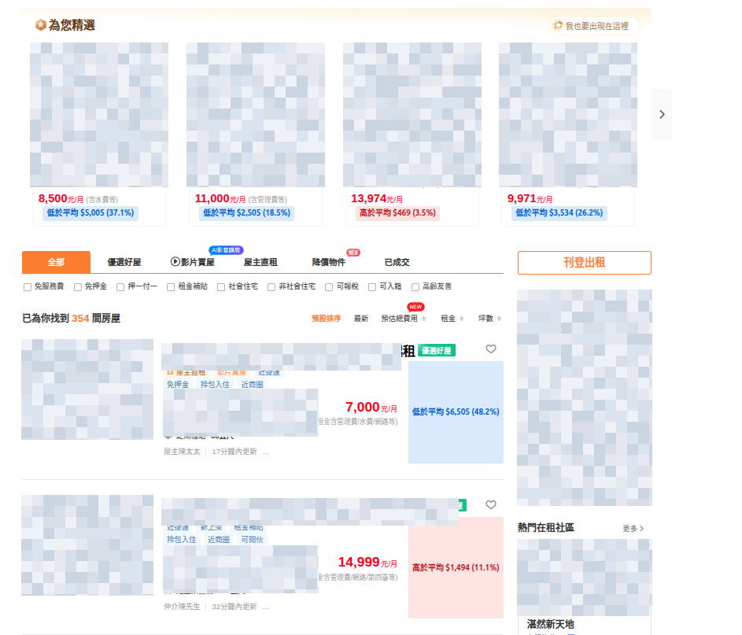

# 591 Rent Average Compare

A small Chrome extension for 591 rental search pages. It reads the rents visible on the current result page, calculates the page average, and marks each listing price as higher, lower, or equal to that average.

The goal is simple: when you are scanning rentals, you can immediately see which listings are expensive or cheap compared with the current search results.

## Features

- Works on `rent.591.com.tw` rental search pages.
- Calculates average monthly rent from visible result cards.
- Shows a compact page summary above the result list.
- Adds a larger inline badge next to each listing price.
- Recalculates when 591 updates results after filtering, sorting, or client-side navigation.
- The extension popup provides an on/off toggle and a manual rescan button.
- No floating panel, no account, no background crawling, no sale-price comparison.

## Example



If the current page average is `$20,000`, the extension marks listings like:

- `$15,000` -> `低於平均 $5,000 (25%)`
- `$20,000` -> `等於平均`
- `$25,000` -> `高於平均 $5,000 (25%)`

## Install Locally

1. Open Chrome and go to `chrome://extensions`.
2. Enable **Developer mode**.
3. Click **Load unpacked**.
4. Select this repository folder.
5. Open a 591 rental search page, for example `https://rent.591.com.tw/list`.

## Usage

Open a 591 rental search result page. The extension automatically inserts:

- One average-rent summary for the current page.
- One high/low/equal badge beside each parsed rent price.

Click the extension icon to open the popup. You can turn annotations on or off, or force a rescan if the page does not update after changing filters.

## Privacy

This extension only reads the current 591 rental search page in your browser. It does not store listing data, open background result tabs, require login credentials, or upload data to any server.

## Support

If this saves you time while looking for rentals, you can support the project here:

https://www.buymeacoffee.com/dd_7777

## Development

Install dependencies:

```bash
npm install
```

Run syntax checks:

```bash
npm run check
```

Run tests:

```bash
npm test
```

## Project Structure

- `manifest.json`: Chrome extension manifest.
- `assets/icons/`: Extension icon source and generated Chrome icon sizes.
- `src/contentScript.js`: Search-page average calculation and inline badges.
- `src/background.js`: Extension icon handler for manual rescans.
- `src/popup.*`: Small popup with enable/disable and rescan controls.
- `src/listingParser.js`: Shared rent listing parsing helpers.
- `tests/`: Node and jsdom tests.

## Known Limits

591 page markup can change. If badges stop appearing or prices are parsed incorrectly, update the card and price selectors in `src/contentScript.js`, then add a jsdom regression test for the new page shape.

## License

MIT. See [LICENSE](LICENSE).
